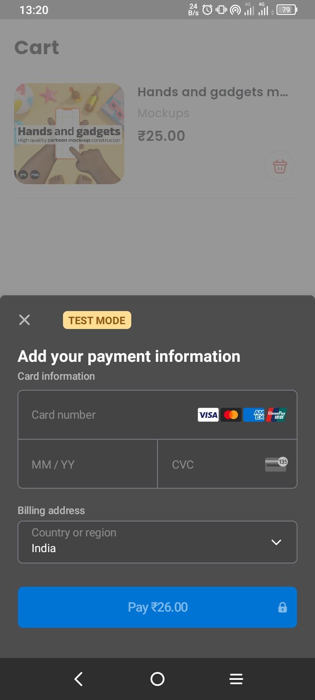

# Clean Architecture Flutter E-Commerce App

## Features

User View

- Products View
- Search Products
- Product Add To Cart
- Product Purchase
- Add Favorite
- View Purchase History
- Download Purchase Product
- View Notifications
- Change Theme
- Change Language

Admin View

- Admin Dashboard
- Product Manage
- Category Manage
- User Manage
- Notifications Manage
- Change Theme
- Change Language

## Screenshots

#### Auth View

#### User View

#### Admin View

#### Others

## Future Implements

- Admin Dashboard
