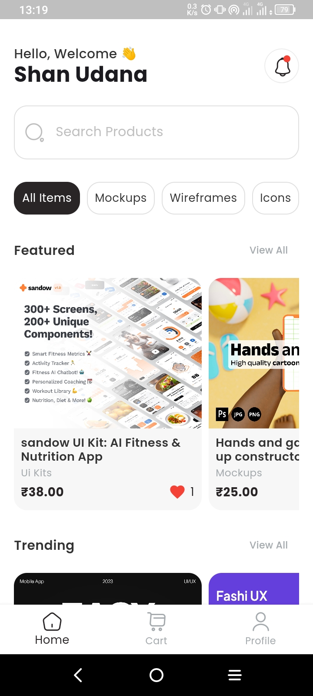
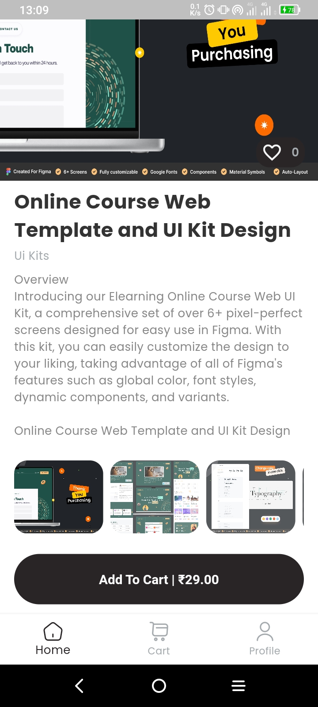
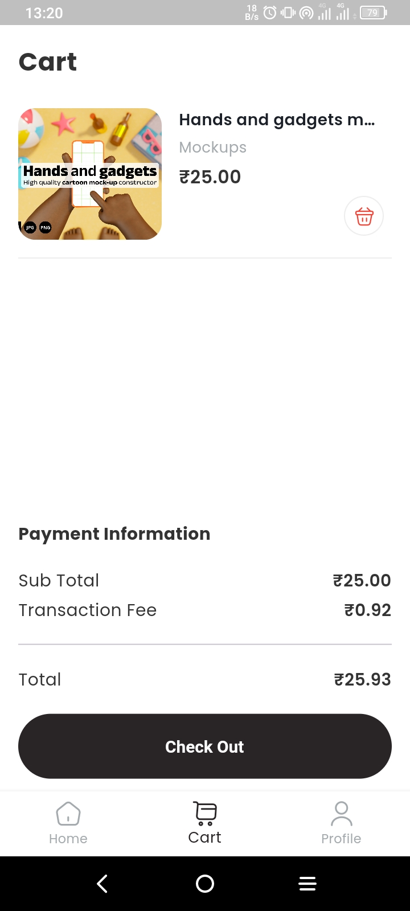
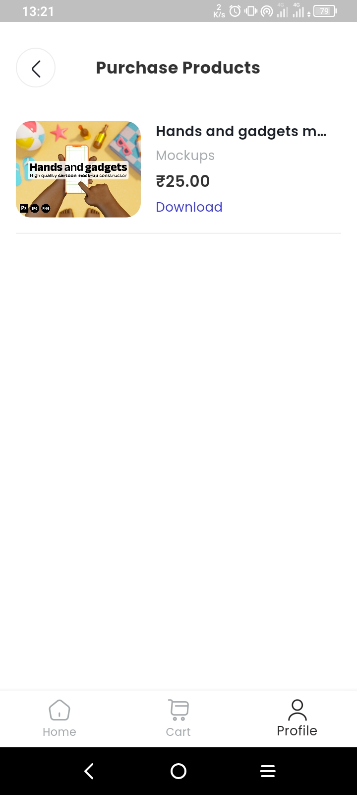
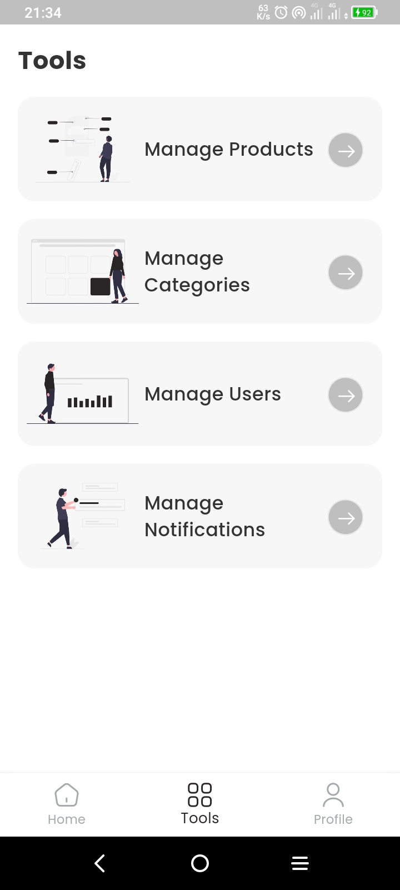

# Clean Architecture Flutter E-Commerce App

## Project Setup

Before you run the project, make sure to follow the steps below to properly set up the environment, generate necessary files, and run the tests.

### 1. Setup the `.env` file

You need to set up the `.env` file in the root directory of the project with your environment-specific variables.

#### Example:

Create a `.env` file in the root directory and include the following keys (replace with your values):

`STRIPE_TEST_PUBLISHABLE_KEY=your_publishable_key`

 

`STRIPE_TEST_SECRET_KEY=your_secret_key`

### 2. Generate Required Files

Run the following command to generate the necessary files (e.g., mocks, code related to the environment variables):

`dart run build_runner build`

### 3. (Optional) Configure Firebase Service Account for Push Notifications

If you wish to enable push notifications, you need to configure the 'firebaseServiceAccountJson' used in the project.

All setup instructions are included directly in the file:

`core/constants/firebase_values.dart`

Make sure to follow the comments inside that file to generate and insert your Firebase service account values correctly.

 

## Features

User View

- View Products
- Search Products
- Add Products to Cart
- Purchase Products
- Add to Favorites
- View Purchase History
- Download Purchased Products
- View Notifications
- Change Theme
- Change Language

Admin View

- Access Admin Dashboard
- Manage Products
- Manage Categories
- Manage Users
- Manage Notifications
- Change Theme
- Change Language

## Screenshots

#### Auth View

#### User View

#### Admin View

 

All product images used in this app are for educational purposes only.
